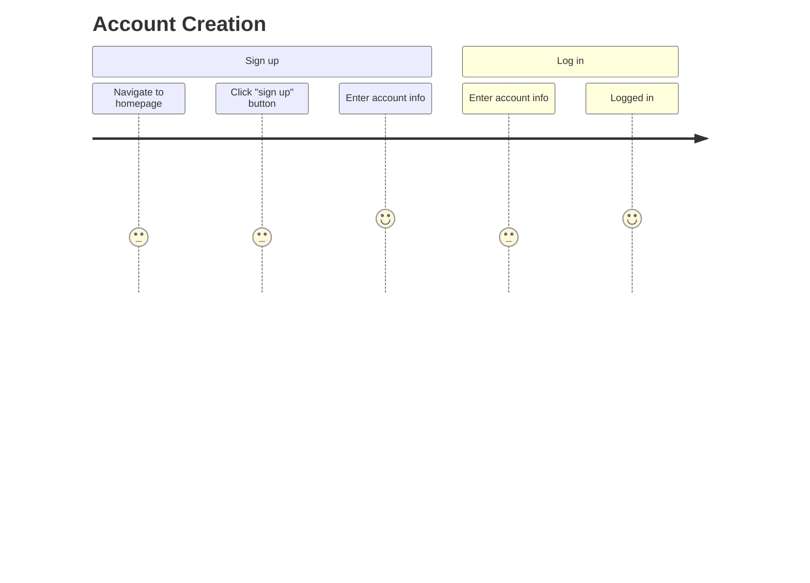
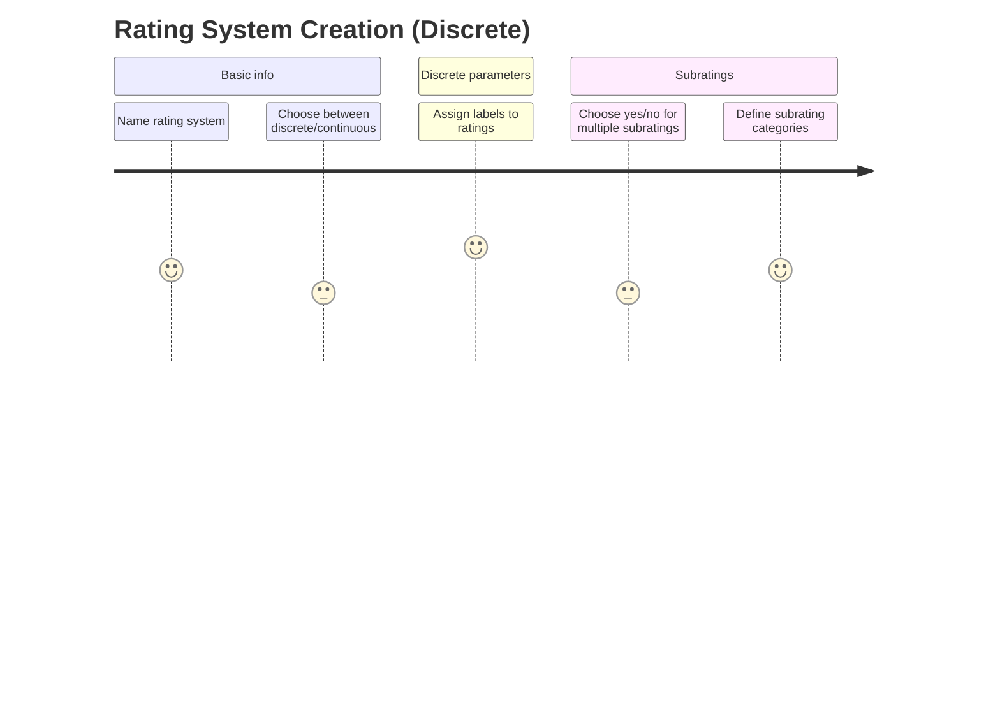
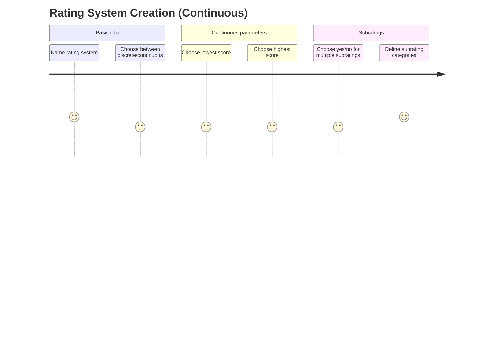
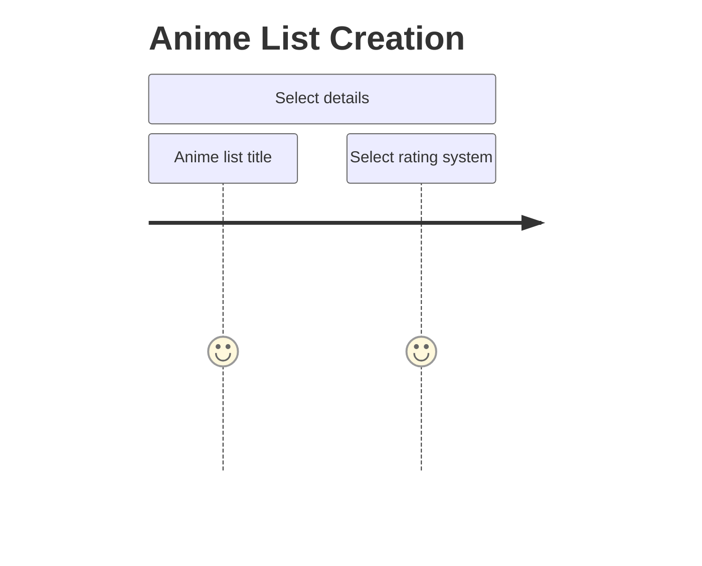
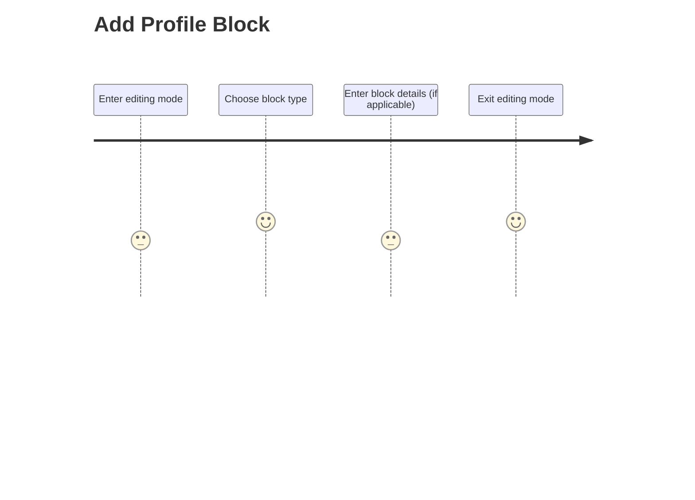
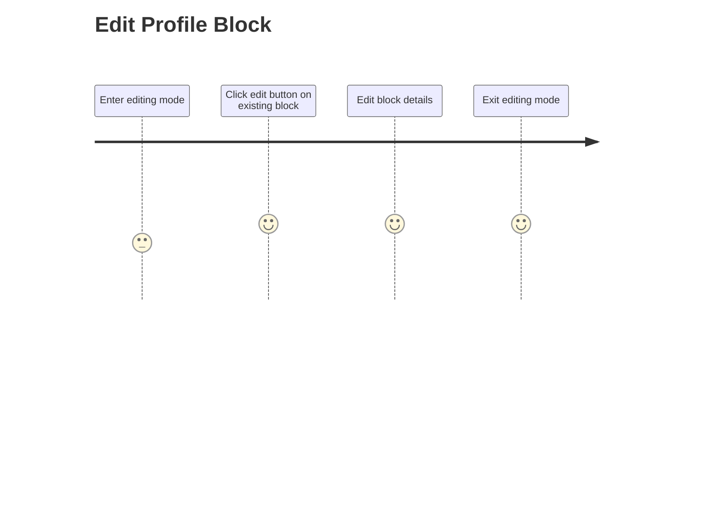
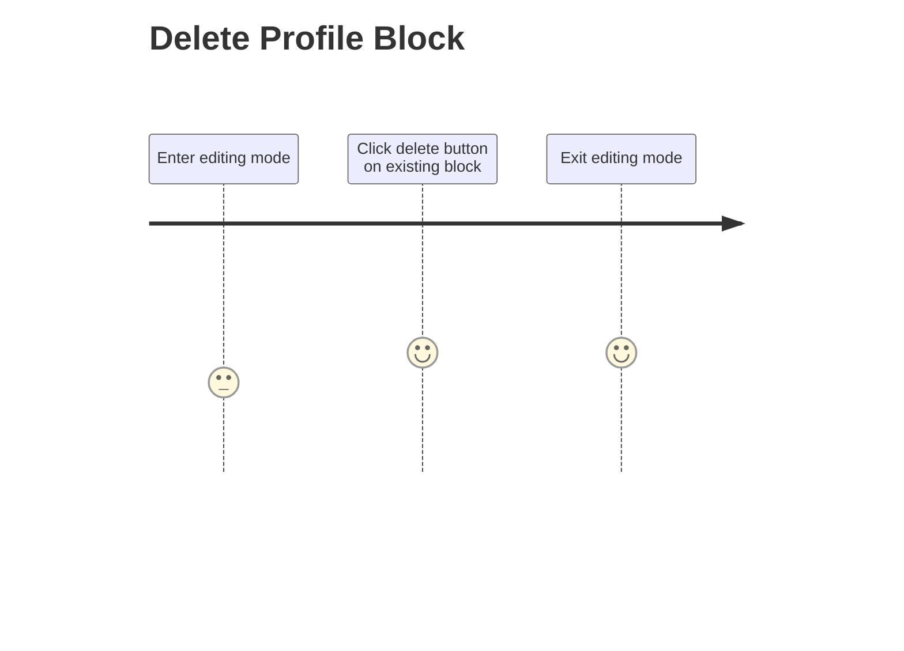
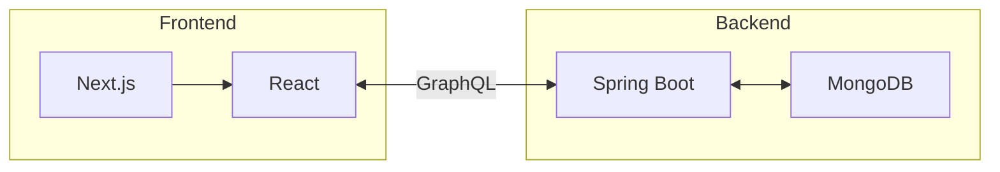

# Anime List Design Doc

## 1. Preamble

This document will provide an overview of the system architecture for our application.

Although this document is formatted as Markdown, it contains diagrams that will not be rendered by GitHub. So we will maintain a PDF copy of this document [here.](https://github.com/ucsb-cs148-f21/project-t10-animelist/blob/main/docs/DESIGN.pdf)

## 2. Background

Our application provides a platform for anime viewers who are interested in maintaining a collection of the series they've watched and are currently watching. Some of the basic features for this type of application include adding entries to a list, setting a status (e.g. plan to watch, currently watching, watched) for each one, and adding a rating for each one.

There are already some capable sites that fulfill this purpose, such as MyAnimeList (MAL) and Anilist. We plan to differentiate ourselves from these existing offerings by catering to a "power-user" group of users that would benefit from a greater degree of customizability. Before apps like MyAnimeList, using a spreadsheet was a common solution for this use case, which required significant manual work but allowed complete customization to the user's needs. We aim to have our app closer to spreadsheets on the customization spectrum, without sacrificing much convenience.

## 3. UX Considerations

As briefly mentioned above, we want our app to be highly customizable and personal compared to the experiences offered by existing anime list apps. However, we recognize that a high degree of customizability can sometimes come at the cost of convenience, which is something we want to avoid. Throughout the design process, we have aimed to balance these two factors.

The following subsections will show some high-level user flows for common processes in our app.

### 3.1. Account Creation

### 3.2. Rating System Creation

Note: we have a separate doc detailing why this system exists and how it works (currently not in repo but should eventually be added). For now, the gist of it is that users can create custom rating systems to associate with their lists. Each rating system can either be discrete (discrete scores can be assigned) or continuous (scores can be any real number in a given range).

### 3.3. Anime List Creation

WIP

### 3.4. Anime List Editing

WIP

### 3.5. Profile Page Customization

## 4. High-Level Architecture

The above diagram shows a high-level diagram of our system architecture.

Our backend consists of two parts: a database for persistence and the main server that handles requests.

For our database, we use MongoDB Atlas. This provides us with a flexible NoSQL database where we can store documents in a JSON format. One primary benefit of this is the ability to model our data within the database in a form that closely matches the way we model the received data in the frontend. Rather than having JSON-shaped data on the frontend and tabular data in the backend, both of them can share a similar structure.

For the main backend server, we use the Spring Boot framework for Java. This allows us to hook into the robust Java ecosystem, giving us libraries to interact with the MongoDB database as well as handle GraphQL requests, which will be discussed a few paragraphs down. In our production deployment, we host this backend server on Heroku.

Our frontend also consists of two parts: the Next.js server that serves the frontend files, and the actual frontend files themselves.

The Next.js server is somewhat of a black box since the implementation is part of the Next.js framework. However, it is still a distinct module in our system architecture, so we will discuss it here. This server is responsible for responding to the client's browser requests and serving the appropriate React frontend files. For example, when the user navigates to `/` the server will respond with the frontend files corresponding to the index page. In our production deployment, this server is hosted on Vercel.

Second, the frontend files that actually run in the user's browser are implemented using React. These files make up the "client" portion of our application, and are responsible for communicating with the backend and displaying the UI of our app.

Finally, as previously mentioned, we use GraphQL to communicate between the frontend and backend! GraphQL is an API specification that acts as an alternative to traditional REST APIs. Rather than making a request to a REST endpoint and receiving data back with a shape determined by the endpoint, GraphQL allows us to traverse a graph of data and specify exactly what objects and fields we want to retrieve. It also allows us to get all of the data we need in a single request, rather than having to make multiple requests to retrieve all of the necessary data. This is because the data is represented as nodes and fields, where the fields can themselves be nodes.

## 5. Design Process Documentation

* 10/6/21: We discussed the problem scenario and user journey for our app. This led us to our initial vision for the app as an anime list that can appeal to a "power user" userbase.

* 10/11/21: After working on the Hello World app, we agreed to use a Next.js / Spring Boot / GraphQL tech stack. We also started brainstorming user stories and creating a set of issues to begin implementation.

* 10/13/21: Agreed to use MongoDB as our database.

* 11/1/21: Completed design document for the user list and custom rating system features. Users will create rating systems that encapsulate all of the information necessary to validate entries in a user list. When creating a new anime list, users will select the rating system and the data for the rating system will be stored as part of the list document.

* 11/4/21: Agreed on the extent to which we want to use TDD. We agreed to try to write unit tests whenever possible and without writing highly redundant test code, and to make limited use of component testing.

* 11/15/21: Completed design document for the profile page customization system. The profile page will consist of a series of blocks, which can each display a given type of content. Users will be able to place and arrange these blocks (semi)-freely.
